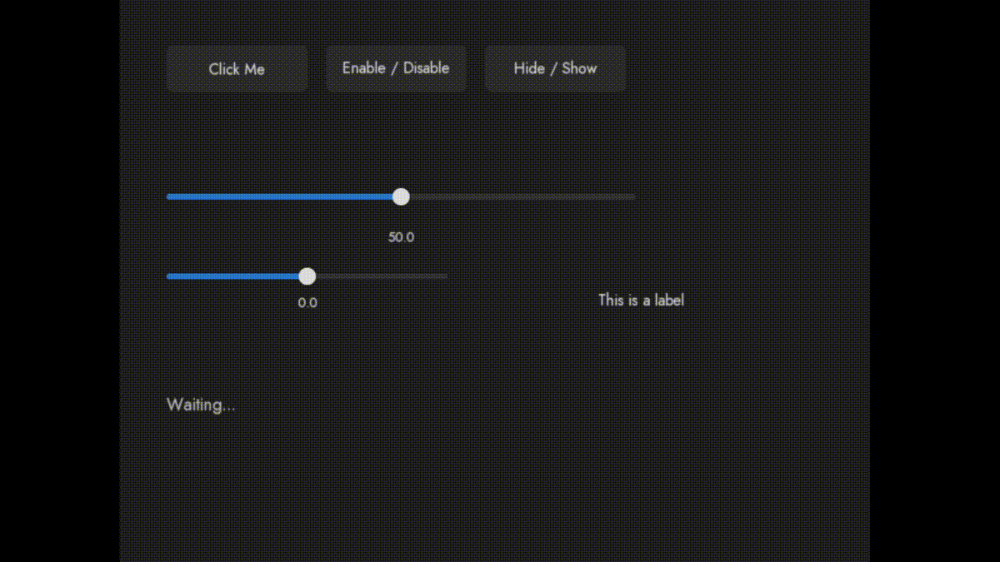
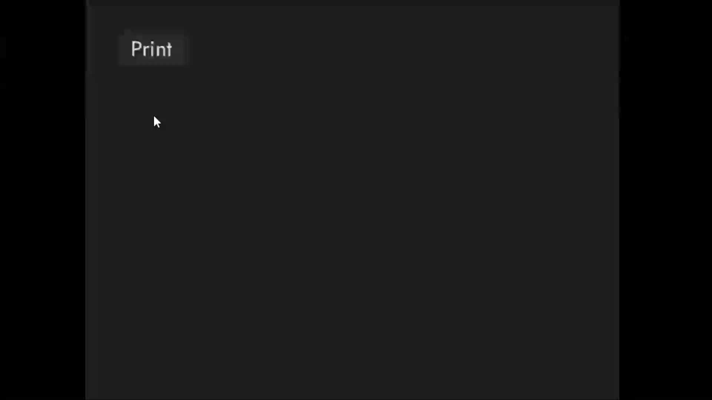

<h1 align="center"> SFUI </h1>
A C++ UI library based on SFML and ThorVG library for simple and fast UI creation in C++. This project can create multiple UI elements like buttons, sliders, pane, labels and further more to be added.

--- 



---

UI elements supported by the library (as for now)

- Buttons
- Sliders
- Labels

Example code for creating a button:

```c++
#include <SFML/Graphics.hpp>
#include "SFUI/SFUI.hpp"

int main()
{
    sf::RenderWindow window(sf::VideoMode({800, 600}), "SFUI", sf::State::Windowed);

    sf::Font font;
    if (!font.openFromFile("arial.ttf"))
    {}

    UIManager ui;

    Button buttonA;
    buttonA.setSize({100.f, 50.f});
    buttonA.setPosition({50.f, 48.f});
    buttonA.setFont(font);
    buttonA.setLabel("Print");
    auto btnA = std::make_shared<Button>(buttonA);
    
    // Add to UI handler
    ui.add(btnA);

    while (window.isOpen())
    {
        // Set visual updates
        ui.handelVisual();
        while (std::optional<sf::Event> event = window.pollEvent())
        {
            if (event->is<sf::Event::Closed>())
            {
                window.close();
            }
            ui.handleEvent(*event, window);
        }

        window.clear(sf::Color(30, 30, 30));
        // Draw to window
        ui.draw(window);
        window.display();
    }
}
```



---

<h3>Note: </h3>

- There is no release version of this project becuase this project is still under development, you can clone the repo and use the project but its not stable
- This project runs on SFML 3.0.2 which is compiled on MingW version of 14.2.0, Read SFML Documentation for further info
- This project also uses ThorVG. So make sure you read the license of ThorVG library too

